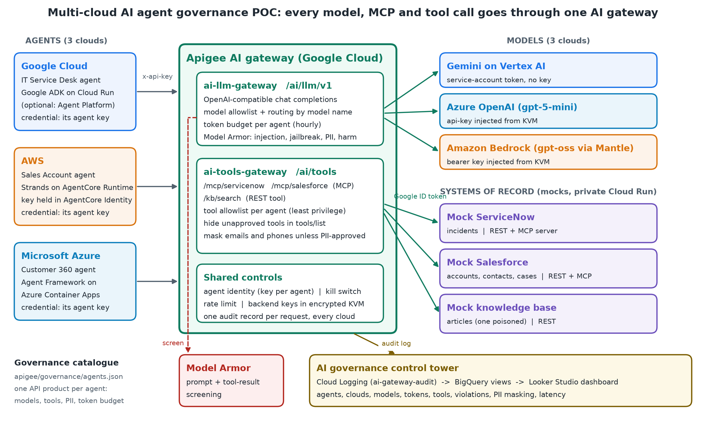

# Multi-cloud AI agent governance with one AI gateway

A proof of concept showing that a central team can govern AI agents running on **three different clouds**, built with
**three different agent frameworks**, by routing all of their traffic through **one AI gateway**.

- Google Cloud: an IT Service Desk agent built with the **Agent Development Kit (ADK)**
- AWS: a Sales Account agent built with **Strands Agents**
- Microsoft Azure: a Customer 360 agent built with **Microsoft Agent Framework**

Each agent holds a single credential, its gateway key. Every model call, MCP tool call and REST tool call goes through
**Apigee**, which decides what that agent is allowed to do. ServiceNow, Salesforce and a knowledge base are simulated by
mock services that expose realistic REST and **MCP** interfaces.



## What the gateway enforces

| Control | How it works | Configured by |
|---|---|---|
| Agent identity | One Apigee app and key per agent; unknown callers get `401` | Apigee app |
| Model allowlist and routing | `gemini-*` goes to Vertex AI, `gpt-*` to Azure OpenAI, `vendor.model` names to Amazon Bedrock | `allowed_models` |
| Model keys never in agents | Backend keys live in Apigee's encrypted key value map; Vertex AI uses the proxy's service account | Key value map |
| Token budget | Hourly budget per agent, charged with the tokens each model actually used | `token_quota_per_hour` |
| Prompt safety | Model Armor screens the newest user text **and tool results** for prompt injection, jailbreaks and sensitive data | Model Armor template |
| Tool least privilege | MCP `tools/call` is checked against the agent's allowlist; denials come back as a readable MCP error | `allowed_tools` |
| Tool discovery filtering | `tools/list` responses only show tools the agent may use | `allowed_tools` |
| PII masking | Emails and phone numbers in tool results are masked unless the agent is approved for personal data | `pii_access` |
| Private systems of record | Backends are private Cloud Run services that only the gateway's service account can call | Cloud Run IAM |
| Kill switch | Revoking an agent's app blocks it for every model and tool, in every cloud | Apigee app status |
| Unified audit | One JSON record per request (allowed or denied) goes to Cloud Logging, then to BigQuery views for a dashboard | Log sink |

Each agent's profile is plain data in [`apigee/governance/agents.json`](apigee/governance/agents.json). Changing a
profile changes the agent's behaviour without redeploying the agent.

## Repository layout

| Path | Contents |
|---|---|
| [`mock-systems/`](mock-systems) | Mock ServiceNow and Salesforce (FastAPI + MCP) and a knowledge-base REST API, one container each |
| [`apigee/proxies/ai-llm-gateway`](apigee/proxies/ai-llm-gateway) | OpenAI-compatible LLM gateway: model allowlist, routing, token budget, Model Armor, audit |
| [`apigee/proxies/ai-tools-gateway`](apigee/proxies/ai-tools-gateway) | MCP and REST tools gateway: tool allowlist, tool filtering, PII masking, audit |
| [`apigee/governance/agents.json`](apigee/governance/agents.json) | The governance catalogue (one product and one app per agent) |
| [`agents/gcp-itsm-agent`](agents/gcp-itsm-agent) | ADK agent (Cloud Run, or Vertex AI Agent Engine) |
| [`agents/aws-sales-agent`](agents/aws-sales-agent) | Strands agent: `app/` for Bedrock AgentCore Runtime, `webapp/` for AWS App Runner |
| [`agents/azure-cx-agent`](agents/azure-cx-agent) | Microsoft Agent Framework agent with a small chat page (Azure Container Apps) |
| [`tools/poc.py`](tools/poc.py) | Admin CLI: Model Armor template, key value map, proxy deployment, agent onboarding, live policy changes |
| [`tools/governance_demo.py`](tools/governance_demo.py) | 17 scripted checks that prove each control, with PASS/FAIL output |
| [`tools/postman/`](tools/postman) | The same 17 checks as a Postman collection |
| [`observability/`](observability) | BigQuery views for the "control tower" dashboard |
| [`tests/`](tests) | Offline unit tests for the gateway policy logic |

## Try it locally (no cloud account)

Requirements: Python 3.12 and Node.js 20+.

```bash
# 1. Unit-test the gateway policy logic (runs the real Apigee JavaScript in a sandbox)
node tests/apigee-policy-tests.js

# 2. Run a mock system of record and call its MCP server
pip install -r mock-systems/salesforce/requirements.txt
uvicorn main:app --port 8082 --app-dir mock-systems/salesforce

curl -s -X POST http://127.0.0.1:8082/mcp/salesforce \
  -H "Content-Type: application/json" -H "Accept: application/json, text/event-stream" \
  -d '{"jsonrpc":"2.0","id":1,"method":"tools/list"}'
```

## Deploy it

You need a Google Cloud project with Apigee (an evaluation organization is enough), an Azure subscription with Azure
OpenAI, and an AWS account with Amazon Bedrock. The outline below uses the helper CLI; every step can also be done in
the cloud consoles.

1. **Configure:** copy `config/poc.env.example` to `config/poc.env` and fill it in as you go. It is git-ignored; never
   commit it.
2. **Google Cloud:** enable the Apigee, Cloud Run, Vertex AI, Model Armor, Logging and BigQuery APIs. Create a service
   account `ai-gateway-proxy` with the Vertex AI User, Model Armor User and Logs Writer roles.
3. **Mock systems:** deploy each folder in `mock-systems/` to Cloud Run **with authentication required**, and grant
   `ai-gateway-proxy` the Cloud Run Invoker role on each.
4. **Models:** deploy a chat model in Azure OpenAI (for example `gpt-5-mini`), and create an Amazon Bedrock API key
   for the OpenAI-compatible endpoint (for example `openai.gpt-oss-120b`).
5. **Gateway:**
   ```bash
   pip install -r tools/requirements.txt
   python tools/poc.py model-armor-template   # safety template
   python tools/poc.py kvm                    # Azure and AWS keys into Apigee's encrypted store
   python tools/poc.py deploy-proxies         # both proxies, running as ai-gateway-proxy
   python tools/poc.py setup-agents           # products, apps and keys from agents.json
   ```
6. **Prove it:** `python tools/governance_demo.py` (add `--live-changes` for the token-budget and kill-switch checks).
7. **Agents:** deploy each agent in `agents/` to its cloud, pointing `AI_GATEWAY_URL` at your Apigee hostname and
   `AI_GATEWAY_API_KEY` at that agent's key.
8. **Dashboard:** `python tools/poc.py observability`, generate some traffic, then `python tools/poc.py create-views`
   and build a Looker Studio report on the `ai_governance` dataset.

## Status and limitations

This is a **proof of concept**, not production code.

- ServiceNow and Salesforce are mocks with fictional sample data. Replacing them with the vendors' own MCP servers is a
  change of backend URL and authentication.
- Agents authenticate to the gateway with API keys. Production should use OAuth or workload identity federation, and
  pass the end user's identity through.
- Only the newest user and tool text is screened, and model responses are not. Screening responses
  (`sanitizeModelResponse`) and adding human approval for high-risk tools are natural next steps.
- The token budget relies on Apigee's shared quota counter (`SharedName`, `EnforceOnly`, `CountOnly`). If your Apigee
  release lacks it, use the `LLMTokenQuota` policy instead.
- Model names differ by region and change over time; they are all configurable.

## License

[Apache License 2.0](LICENSE)
